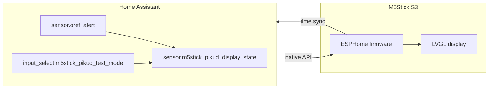

# M5Stick S3 Pikud display (ESPHome + Home Assistant)

[](https://github.com/maximunited/m5stick-s3-pikud/actions/workflows/ci.yml)

Pikud HaOref civil-defense alerts on an **M5Stack Stick S3** display, driven by Home Assistant — without coupling to your Pikud lighting automations.

- **Clock** at idle (12-hour + date)
- **Pre-alert / alert / safe** animations synced from HA
- **Test scripts** to exercise the display without firing scene automations
- **USB flash** once, then **OTA** over Wi-Fi

## Documentation

| Guide | Description |
| ----- | ----------- |
| [Architecture](docs/ARCHITECTURE.md) | Components, data flow, safe-state logic |
| [Troubleshooting](docs/TROUBLESHOOTING.md) | Flash, Wi-Fi, pairing, tests |
| [Home Assistant merge](homeassistant/README.md) | Snippets to add to your HA config |

Full index: [docs/README.md](docs/README.md)

## Hardware

| Item | Notes |
| --- | --- |
| **M5Stack Stick S3** (UiFlow2) | Built-in 0.96" display, buttons A/B, battery |
| **USB-C** | Flash + optional always-on power |
| **2.4 GHz Wi-Fi** | ESP32-S3 has no 5 GHz |

USB IDs:

| Mode | USB ID |
| --- | --- |
| Normal | `303a:832b` |
| Bootloader (green LED flashing) | `303a:1001` |

**Side button:** long press → download mode; **single click** → run firmware.

## Architecture



| Layer | Typical host | Role |
| --- | --- | --- |
| USB flash | Linux box with stick attached (`/dev/ttyACM0`) | First-time programming only |
| Runtime | Wi-Fi LAN | ESPHome API ↔ HA |
| HA | Docker or supervised install | Oref sensor, display driver template, test scripts |

## Prerequisites

1. **Home Assistant** with [Oref Alert](https://github.com/amitfin/oref_alert) (`sensor.oref_alert` working).
2. **ESPHome CLI** on the flash host (2024.12+; tested with 2026.6.x):

   ```bash
   pip install esphome
   ```

3. **Python venv** (Debian/Proxmox): `apt install python3-venv`

## Quick start

### 1. Clone and configure secrets

```bash
git clone https://github.com/maximunited/m5stick-s3-pikud.git
cd m5stick-s3-pikud/esphome
cp secrets.yaml.sample secrets.yaml
```

Edit `secrets.yaml`:

```yaml
wifi_ssid: "Your 2.4GHz SSID"
wifi_password: "your_password"
api_encryption_key: "<openssl rand -base64 32>"
ota_password: "<openssl rand -hex 16>"
ap_password: "fallback-hotspot-password"
```

Generate keys:

```bash
openssl rand -base64 32   # api_encryption_key
openssl rand -hex 16      # ota_password
```

Keep `api_encryption_key` stable across re-flashes so HA pairing survives OTA.

### 2. First flash (USB)

Connect the stick via USB. Confirm the device:

```bash
lsusb | grep 303a
ls -la /dev/ttyACM0
```

If the green LED flashes continuously, **single-click** the side button to exit bootloader, or long-press to enter it for flashing.

```bash
esphome run m5stick-s3.yaml --device /dev/ttyACM0
```

First compile takes ~10–15 minutes. Upload must complete without USB disconnect — reseat the cable if `dmesg` shows `usb disconnect`.

### 3. Verify Wi-Fi

After reboot, the stick should appear on your LAN:

```bash
ping m5stick-s3.local
nmap -p 6053 m5stick-s3.local
```

**Common failure:** wrong SSID spelling or 5 GHz-only network. ESP32 needs **2.4 GHz**.

Diagnostic firmware (Wi-Fi only, no display logic):

```bash
esphome run m5stick-s3-minimal.yaml --device /dev/ttyACM0
```

### 4. Home Assistant config

Merge files from [`homeassistant/`](homeassistant/README.md) into your HA config. Restart HA and confirm entities load.

### 5. Pair ESPHome in HA

**Settings → Devices & services → Add integration → ESPHome**

| Field | Value |
| --- | --- |
| Host | `m5stick-s3.local` or stick IP |
| Encryption key | `api_encryption_key` from `secrets.yaml` |

The stick subscribes to `sensor.m5stick_pikud_display_state` and syncs time from HA.

### 6. OTA updates

```bash
esphome run m5stick-s3.yaml --device m5stick-s3.local
```

## Display behaviour

Subscribes to **`sensor.m5stick_pikud_display_state`** (not `sensor.oref_alert` directly).

| State | Display |
| --- | --- |
| Clock / idle | 12-hour clock + date; **HA** (green) or **HA?** (orange) when API disconnected |
| `pre_alert` | Orange **Pre-Alert** / **התרעה מוקדמת** 3s → full orange 3s → loop |
| `alert` | Red **ALERT !** / **אזעקה!** + live shelter countdown → full red 3s → loop |
| `ok` (live) | Green **SAFE** / **בטוח** only after real `alert`/`pre_alert` → `ok` |
| `test_ok` | Green **SAFE** (test script) |

**Power:** Charging via `M5.Power.isCharging()` (PMIC `readVin` is unreliable). On USB the clock shows **PWR** (blue) instead of a stale charge percentage. On battery, the clock shows color-coded **%** (green ≥60, amber 30–59, red below 30). HA entity `sensor.m5stick_s3_battery_level` is unavailable while charging.

**Screen sleep:** On battery, the display auto-sleeps after 30 s idle on the clock. On USB you turn the screen off manually with **A**. While asleep, alert loops keep running but do not turn the backlight back on until you wake or a **new** Oref state change arrives.

**Safe screen duration:** `input_number.m5stick_pikud_safe_minutes` in HA (0.5–60 min, default 5).

**Alert language:** `input_select.m5stick_pikud_alert_language` — `english` or `hebrew`.

**Rotation:** **B** on the clock cycles 0° → 90° → 180° → 270° (saved across reboots).

## Buttons

| Control | Action |
| --- | --- |
| **A short** | Toggle screen off/on; keeps current mode (clock, alert, safe, …) |
| **A double** | Dismiss to clock — stops alert loops, screen on |
| **B short** (clock) | Rotate 90° and wake screen if asleep |
| **B short** (alert) | Wake screen and refresh shelter countdown |
| **B short** (pre-alert / safe) | Wake screen |

## Test without Pikud scene automations

Pikud lighting automations react to `sensor.oref_alert`. Tests use a separate driver sensor.

**Developer tools → Services:**

| Script | Effect |
| --- | --- |
| `script.m5stick_pikud_test_clock` | Clock |
| `script.m5stick_pikud_test_pre_alert` | Orange loop |
| `script.m5stick_pikud_test_alert` | Red loop |
| `script.m5stick_pikud_test_safe` | Green loop |
| `script.m5stick_pikud_test_live` | Mirror live Oref again |

## Repository layout

```
esphome/
  m5stick-s3.yaml              # Entry point (substitutions + packages)
  packages/
    m5stick_hardware.yaml      # ESP32, Wi-Fi, API, intervals
    m5stick_sensors.yaml       # HA subscriptions, battery/charging entities
    m5stick_buttons.yaml       # GPIO buttons
    m5stick_ui.yaml            # LVGL pages, fonts, backlight
    m5stick_scripts.yaml       # Display logic
  m5stick-s3-minimal.yaml      # Wi-Fi diagnostic build
  secrets.yaml.sample
homeassistant/
  templates/m5stick_pikud.yaml
  input_select.yaml
  input_number.yaml
  scripts.yaml
  configuration.snippet.yaml
docs/
  README.md
  ARCHITECTURE.md
  TROUBLESHOOTING.md
```

## Troubleshooting

See [docs/TROUBLESHOOTING.md](docs/TROUBLESHOOTING.md).

## Credits

- Display component: [TitoTB/M5StickS3-ESPHome](https://github.com/TitoTB/M5StickS3-ESPHome)
- Oref integration: [amitfin/oref_alert](https://github.com/amitfin/oref_alert)

## License

MIT
