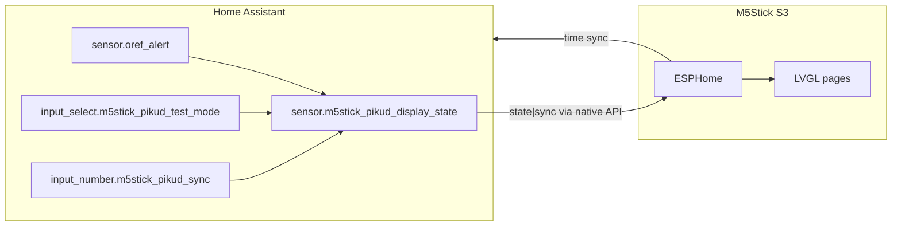

# Architecture

## Components

| Piece | Location | Role |
| ----- | -------- | ---- |
| ESPHome firmware | `esphome/m5stick-s3.yaml` | Display, buttons, LVGL UI, subscribes to HA |
| Display driver | [TitoTB/M5StickS3-ESPHome](https://github.com/TitoTB/M5StickS3-ESPHome) | M5Stick S3 screen + power |
| HA template | `homeassistant/templates/m5stick_pikud.yaml` | Builds `sensor.m5stick_pikud_display_state` |
| Test helpers | `input_select`, `input_number`, scripts | Override display without Pikud scene automations |
| Oref source | `sensor.oref_alert` (integration) | Real civil-defense state |

## Data flow

## Display state encoding

Published state format: `<semantic>|<sync>`.

| Mode | Semantic examples |
| ---- | ----------------- |
| Live | `pre_alert`, `alert`, `ok` (from Oref) |
| Test | `test_clock`, `test_pre_alert`, `test_alert`, `test_ok` |

The sync counter increments on every test script run so ESPHome always receives `on_value`, even when the semantic part repeats.

## Safe (green) logic

| Transition | Show SAFE loop? |
| ---------- | ---------------- |
| Idle / boot with `ok` | No — clock |
| `alert` or `pre_alert` → `ok` (live) | Yes |
| Any → `test_ok` | Yes (test) |
| `test_clock` → live `ok` | No |

## Pikud automations stay separate

Lighting/scene automations listen to `sensor.oref_alert` only. The stick reads `sensor.m5stick_pikud_display_state`, so test scripts never trigger home lighting changes.
